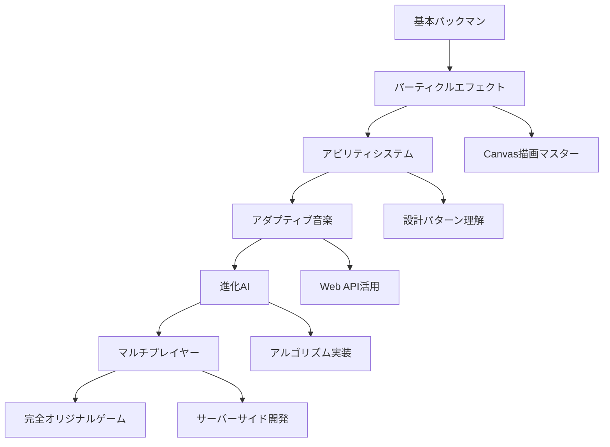

# パックマンゲーム オリジナリティ提案

リアルタイムバトルゲーム開発の学習として、このパックマンゲームに**オリジナリティ**を加える提案です。

## 🎮 **ゲームプレイ革新アイデア**

### 1. **リアルタイムマルチプレイヤー対戦**
```javascript
// WebSocketを使った対戦システム
class MultiplayerGame {
    constructor() {
        this.socket = new WebSocket('ws://localhost:8080');
        this.players = new Map(); // 他プレイヤーの管理
        this.gameMode = 'competitive'; // competitive, cooperative, battle-royale
    }
    
    // 4人プレイヤー vs 4匹ゴースト の対戦
    // プレイヤー同士でドット争奪戦
}
```

**実装のポイント:**
- WebSocketサーバー構築（Node.js + Socket.io）
- プレイヤー同期システム
- 遅延補正（予測移動）
- 公平性確保（サーバー権威）

### 2. **動的迷路システム**
```javascript
class DynamicMaze extends Maze {
    constructor() {
        super();
        this.movingWalls = [];
        this.temporaryWalls = [];
        this.teleporters = [];
    }
    
    updateMaze(deltaTime) {
        // 時間経過で壁が移動・出現・消失
        this.updateMovingWalls(deltaTime);
        this.updateTemporaryWalls(deltaTime);
        this.spawnRandomTeleporters();
    }
    
    // プレイヤーが壁を破壊/生成できるアビリティ
    playerCreateWall(x, y, duration = 5) {
        this.temporaryWalls.push({
            x, y, duration, timeLeft: duration
        });
    }
}
```

### 3. **アビリティ・スキルシステム**
```javascript
class Player extends BasePlayer {
    constructor(maze) {
        super(maze);
        this.abilities = {
            dash: { 
                cooldown: 3, 
                active: false,
                effect: () => this.speed *= 3,
                duration: 0.5
            },
            invisibility: { 
                cooldown: 10, 
                duration: 2,
                effect: () => this.invisible = true
            },
            wallBreaker: { 
                cooldown: 15, 
                uses: 3,
                effect: (x, y) => this.maze.breakWall(x, y)
            },
            timeFreeze: { 
                cooldown: 20, 
                duration: 1,
                effect: () => this.game.freezeGhosts()
            }
        };
    }
    
    useAbility(abilityName) {
        const ability = this.abilities[abilityName];
        if (ability && ability.cooldown <= 0) {
            ability.effect();
            ability.cooldown = ability.maxCooldown;
        }
    }
}
```

## 🎯 **AI・戦略システム**

### 4. **進化するゴーストAI**
```javascript
class EvolutionaryGhost extends Ghost {
    constructor(x, y, color, maze, player) {
        super(x, y, color, maze, player);
        this.learningData = {
            playerPatterns: [], // プレイヤーの移動パターン履歴
            successfulMoves: [], // 成功した動き
            adaptationLevel: 1,  // 学習レベル
            memory: new Map()    // 位置ごとの経験値
        };
    }
    
    learnFromPlayer() {
        // プレイヤーの行動パターンを分析
        const playerPos = this.player.getGridPosition();
        const pattern = {
            position: playerPos,
            direction: this.player.currentDirection,
            timestamp: Date.now()
        };
        
        this.learningData.playerPatterns.push(pattern);
        
        // 最新100パターンのみ保持
        if (this.learningData.playerPatterns.length > 100) {
            this.learningData.playerPatterns.shift();
        }
    }
    
    predictPlayerMovement() {
        // 過去のパターンから次の移動を予測
        const recentPatterns = this.learningData.playerPatterns.slice(-10);
        // 機械学習アルゴリズムを簡易実装
        return this.analyzePatterns(recentPatterns);
    }
    
    // 時間が経つほど賢くなる
    updateAdaptation(deltaTime) {
        this.learningData.adaptationLevel += deltaTime * 0.001;
        this.speed = this.baseSpeed * (1 + this.learningData.adaptationLevel * 0.1);
    }
}
```

### 5. **チーム戦略システム**
```javascript
class TeamAI {
    constructor(ghosts) {
        this.ghosts = ghosts;
        this.formations = ['surround', 'chase', 'ambush', 'scatter'];
        this.currentStrategy = 'chase';
        this.communicationRange = 5; // ゴースト間通信範囲
    }
    
    updateTeamStrategy(player) {
        const playerPos = player.getGridPosition();
        
        // プレイヤーの状況に応じて戦略変更
        if (player.hasAbility('dash') && player.abilities.dash.active) {
            this.currentStrategy = 'scatter'; // 距離を取る
        } else if (this.getDistanceToPlayer(playerPos) < 3) {
            this.currentStrategy = 'surround'; // 包囲
        }
        
        this.executeStrategy(playerPos);
    }
    
    executeStrategy(playerPos) {
        switch (this.currentStrategy) {
            case 'surround':
                this.executeSurroundFormation(playerPos);
                break;
            case 'ambush':
                this.executeAmbushFormation(playerPos);
                break;
            // その他の戦略...
        }
    }
    
    executeSurroundFormation(playerPos) {
        // ゴーストが協調して包囲網を作る
        const positions = [
            { x: playerPos.x, y: playerPos.y - 2 }, // 上
            { x: playerPos.x, y: playerPos.y + 2 }, // 下
            { x: playerPos.x - 2, y: playerPos.y }, // 左
            { x: playerPos.x + 2, y: playerPos.y }  // 右
        ];
        
        this.ghosts.forEach((ghost, index) => {
            if (positions[index]) {
                ghost.setTarget(positions[index]);
            }
        });
    }
}
```

## 🎨 **ビジュアル・演出革新**

### 6. **パーティクルエフェクトシステム**
```javascript
class ParticleSystem {
    constructor(ctx) {
        this.ctx = ctx;
        this.particles = [];
        this.effects = {
            powerPelletExplosion: { 
                color: '#ffff00', 
                count: 20, 
                speed: 50, 
                life: 1.0 
            },
            ghostDefeat: { 
                color: '#0000ff', 
                count: 15, 
                speed: 30, 
                life: 0.8 
            },
            speedTrail: { 
                color: '#ffffff', 
                fade: true, 
                count: 5, 
                life: 0.3 
            },
            dotCollection: {
                color: '#ffff00',
                count: 8,
                speed: 20,
                life: 0.5
            }
        };
    }
    
    createEffect(type, x, y) {
        const effect = this.effects[type];
        if (!effect) return;
        
        for (let i = 0; i < effect.count; i++) {
            this.particles.push(new Particle({
                x: x,
                y: y,
                vx: (Math.random() - 0.5) * effect.speed,
                vy: (Math.random() - 0.5) * effect.speed,
                color: effect.color,
                life: effect.life,
                maxLife: effect.life
            }));
        }
    }
    
    update(deltaTime) {
        this.particles = this.particles.filter(particle => {
            particle.update(deltaTime);
            return particle.life > 0;
        });
    }
    
    render() {
        this.particles.forEach(particle => particle.render(this.ctx));
    }
}

class Particle {
    constructor(options) {
        this.x = options.x;
        this.y = options.y;
        this.vx = options.vx;
        this.vy = options.vy;
        this.color = options.color;
        this.life = options.life;
        this.maxLife = options.maxLife;
    }
    
    update(deltaTime) {
        this.x += this.vx * deltaTime;
        this.y += this.vy * deltaTime;
        this.life -= deltaTime;
        
        // 重力効果
        this.vy += 50 * deltaTime;
        
        // 摩擦
        this.vx *= 0.98;
        this.vy *= 0.98;
    }
    
    render(ctx) {
        const alpha = this.life / this.maxLife;
        ctx.save();
        ctx.globalAlpha = alpha;
        ctx.fillStyle = this.color;
        ctx.beginPath();
        ctx.arc(this.x, this.y, 2, 0, Math.PI * 2);
        ctx.fill();
        ctx.restore();
    }
}
```

### 7. **動的ライティングシステム**
```javascript
class LightingEngine {
    constructor(ctx, canvas) {
        this.ctx = ctx;
        this.canvas = canvas;
        this.lightSources = [];
        this.shadowMap = [];
        this.ambientLight = 0.2; // 基本明度
    }
    
    addLightSource(x, y, radius, intensity, color = '#ffffff') {
        this.lightSources.push({
            x, y, radius, intensity, color,
            flickering: false,
            flickerSpeed: 0
        });
    }
    
    // プレイヤー周辺のみ明るく（ホラー要素）
    createPlayerLight(player) {
        this.lightSources = this.lightSources.filter(light => 
            light.source !== 'player'
        );
        
        this.addLightSource(
            player.x * 20 + 10,
            player.y * 20 + 10,
            60, // 照明範囲
            0.8, // 強度
            '#ffff88'
        );
        this.lightSources[this.lightSources.length - 1].source = 'player';
    }
    
    // ゴーストの目が光る
    createGhostEyes(ghosts) {
        ghosts.forEach((ghost, index) => {
            this.addLightSource(
                ghost.x * 20 + 10,
                ghost.y * 20 + 10,
                15, // 小さな光
                0.6,
                ghost.mode === 'frightened' ? '#0000ff' : '#ff0000'
            );
        });
    }
    
    render() {
        // 暗闇をベースにレンダリング
        this.ctx.save();
        this.ctx.fillStyle = `rgba(0, 0, 0, ${1 - this.ambientLight})`;
        this.ctx.fillRect(0, 0, this.canvas.width, this.canvas.height);
        
        // 光源を描画（加算合成）
        this.ctx.globalCompositeOperation = 'lighter';
        
        this.lightSources.forEach(light => {
            const gradient = this.ctx.createRadialGradient(
                light.x, light.y, 0,
                light.x, light.y, light.radius
            );
            
            gradient.addColorStop(0, `rgba(255, 255, 255, ${light.intensity})`);
            gradient.addColorStop(1, 'rgba(255, 255, 255, 0)');
            
            this.ctx.fillStyle = gradient;
            this.ctx.beginPath();
            this.ctx.arc(light.x, light.y, light.radius, 0, Math.PI * 2);
            this.ctx.fill();
        });
        
        this.ctx.restore();
    }
}
```

## 🎵 **サウンド・音楽システム**

### 8. **アダプティブ音楽システム**
```javascript
class AdaptiveAudio {
    constructor() {
        this.musicLayers = {
            ambient: new Audio('assets/audio/ambient.mp3'),
            tension: new Audio('assets/audio/tension.mp3'),
            chase: new Audio('assets/audio/chase.mp3'),
            victory: new Audio('assets/audio/victory.mp3'),
            danger: new Audio('assets/audio/danger.mp3')
        };
        
        this.soundEffects = {
            dotCollect: new Audio('assets/audio/dot.mp3'),
            powerPellet: new Audio('assets/audio/power.mp3'),
            ghostEaten: new Audio('assets/audio/ghost_eaten.mp3'),
            death: new Audio('assets/audio/death.mp3'),
            teleport: new Audio('assets/audio/teleport.mp3')
        };
        
        this.currentIntensity = 0;
        this.targetIntensity = 0;
        this.intensityTransitionSpeed = 2; // 1秒で完全移行
        
        // 各レイヤーをループ設定
        Object.values(this.musicLayers).forEach(audio => {
            audio.loop = true;
            audio.volume = 0;
        });
    }
    
    init() {
        // 全レイヤーを同時再生開始（音量0）
        Object.values(this.musicLayers).forEach(audio => {
            audio.play().catch(e => console.log('Audio play failed:', e));
        });
    }
    
    updateIntensity(player, ghosts) {
        let newIntensity = 0;
        
        // プレイヤーと最も近いゴーストの距離を計算
        const playerPos = player.getGridPosition();
        let minDistance = Infinity;
        
        ghosts.forEach(ghost => {
            if (ghost.mode !== 'dead') {
                const distance = Math.sqrt(
                    Math.pow(ghost.x - playerPos.x, 2) + 
                    Math.pow(ghost.y - playerPos.y, 2)
                );
                minDistance = Math.min(minDistance, distance);
            }
        });
        
        // 距離に基づいて緊張度設定
        if (minDistance < 2) {
            newIntensity = 1.0; // 最大緊張
        } else if (minDistance < 4) {
            newIntensity = 0.7; // 高緊張
        } else if (minDistance < 6) {
            newIntensity = 0.4; // 中緊張
        } else {
            newIntensity = 0.1; // 低緊張
        }
        
        this.targetIntensity = newIntensity;
    }
    
    update(deltaTime) {
        // 緊張度の滑らかな遷移
        const diff = this.targetIntensity - this.currentIntensity;
        this.currentIntensity += diff * this.intensityTransitionSpeed * deltaTime;
        
        // 音楽レイヤーの音量調整
        this.musicLayers.ambient.volume = Math.max(0, 0.3 - this.currentIntensity * 0.3);
        this.musicLayers.tension.volume = Math.min(0.5, this.currentIntensity * 0.5);
        this.musicLayers.chase.volume = Math.max(0, (this.currentIntensity - 0.5) * 0.6);
        this.musicLayers.danger.volume = Math.max(0, (this.currentIntensity - 0.8) * 0.8);
    }
    
    // 3Dサウンド（左右の音響定位）
    playPositionalSound(soundName, x, y, playerX, playerY) {
        const sound = this.soundEffects[soundName];
        if (!sound) return;
        
        // プレイヤーからの相対位置を計算
        const relativeX = x - playerX;
        const distance = Math.sqrt(relativeX * relativeX + Math.pow(y - playerY, 2));
        
        // 音量は距離に反比例
        const volume = Math.max(0, 1 - distance / 10);
        
        // パンニング（左右定位）
        const panValue = Math.max(-1, Math.min(1, relativeX / 5));
        
        // Web Audio APIを使用した3Dサウンド
        const audioContext = new AudioContext();
        const source = audioContext.createBufferSource();
        const gainNode = audioContext.createGain();
        const panNode = audioContext.createStereoPanner();
        
        gainNode.gain.value = volume;
        panNode.pan.value = panValue;
        
        source.connect(gainNode);
        gainNode.connect(panNode);
        panNode.connect(audioContext.destination);
        
        // サウンド再生
        fetch(sound.src)
            .then(response => response.arrayBuffer())
            .then(data => audioContext.decodeAudioData(data))
            .then(audioBuffer => {
                source.buffer = audioBuffer;
                source.start();
            });
    }
}
```

## 🏆 **ゲームモード拡張**

### 9. **バトルロイヤルモード**
```javascript
class BattleRoyaleMode extends Game {
    constructor() {
        super();
        this.shrinkingMaze = new ShrinkingMaze();
        this.playersAlive = 16;
        this.safeZone = { x: 13, y: 11, radius: 10 };
        this.shrinkTimer = 0;
        this.shrinkInterval = 30; // 30秒ごとに縮小
        this.items = [];
        this.maxPlayers = 16;
    }
    
    initializeBattleRoyale() {
        // プレイヤーをランダム位置に配置
        this.spawnPlayersRandomly();
        
        // アイテムをマップに配置
        this.spawnRandomItems();
        
        // 縮小開始までの猶予時間
        this.shrinkTimer = this.shrinkInterval;
    }
    
    update(deltaTime) {
        super.update(deltaTime);
        
        // セーフゾーン縮小管理
        this.updateSafeZone(deltaTime);
        
        // プレイヤーがセーフゾーン外にいる場合はダメージ
        this.checkPlayersInSafeZone();
        
        // アイテムスポーン管理
        this.manageItemSpawns(deltaTime);
    }
    
    updateSafeZone(deltaTime) {
        this.shrinkTimer -= deltaTime;
        
        if (this.shrinkTimer <= 0) {
            // セーフゾーンを縮小
            this.safeZone.radius = Math.max(2, this.safeZone.radius - 1);
            this.shrinkTimer = this.shrinkInterval;
            
            // 縮小間隔も短くなる
            this.shrinkInterval = Math.max(10, this.shrinkInterval - 2);
        }
    }
    
    spawnRandomItems() {
        const itemTypes = [
            'speedBoost', 'shield', 'ghostRepel', 'extraLife',
            'doubleScore', 'wallBreaker', 'teleporter'
        ];
        
        for (let i = 0; i < 20; i++) {
            const x = Math.floor(Math.random() * 27);
            const y = Math.floor(Math.random() * 23);
            
            if (this.maze.canMoveTo(x, y)) {
                this.items.push({
                    x, y,
                    type: itemTypes[Math.floor(Math.random() * itemTypes.length)],
                    spawnTime: Date.now(),
                    duration: 30 // 30秒後に消失
                });
            }
        }
    }
}

class ShrinkingMaze extends Maze {
    constructor() {
        super();
        this.originalLayout = this.layout.map(row => [...row]);
    }
    
    shrinkMaze(centerX, centerY, radius) {
        for (let y = 0; y < this.height; y++) {
            for (let x = 0; x < this.width; x++) {
                const distance = Math.sqrt(
                    Math.pow(x - centerX, 2) + Math.pow(y - centerY, 2)
                );
                
                if (distance > radius) {
                    this.layout[y][x] = 1; // 壁にする
                }
            }
        }
    }
}
```

### 10. **協力防衛モード**
```javascript
class TowerDefenseMode extends Game {
    constructor() {
        super();
        this.waves = [];
        this.currentWave = 0;
        this.towers = [];
        this.resources = 100;
        this.waveTimer = 0;
        this.waveInterval = 45; // 45秒間隔
        this.baseHealth = 100;
    }
    
    initializeTowerDefense() {
        this.generateWaves();
        this.setupPlayerBase();
    }
    
    generateWaves() {
        for (let i = 1; i <= 20; i++) {
            this.waves.push({
                number: i,
                enemies: Math.floor(5 + i * 1.5), // 敵数が増加
                enemySpeed: 2 + i * 0.1, // 速度上昇
                enemyHealth: 1 + Math.floor(i / 3), // 体力上昇
                specialEnemies: i > 5 ? Math.floor(i / 5) : 0 // 特殊敵
            });
        }
    }
    
    update(deltaTime) {
        super.update(deltaTime);
        
        // ウェーブ管理
        this.updateWaves(deltaTime);
        
        // タワー攻撃処理
        this.updateTowers(deltaTime);
        
        // リソース管理
        this.updateResources(deltaTime);
    }
    
    // プレイヤーが迷路内にタワー設置
    placeTower(x, y, towerType) {
        const cost = this.getTowerCost(towerType);
        
        if (this.resources >= cost && this.maze.canMoveTo(x, y)) {
            this.towers.push({
                x, y, type: towerType,
                damage: this.getTowerDamage(towerType),
                range: this.getTowerRange(towerType),
                fireRate: this.getTowerFireRate(towerType),
                lastShot: 0
            });
            
            this.resources -= cost;
            this.maze.layout[y][x] = 4; // タワータイル
        }
    }
    
    getTowerTypes() {
        return {
            basic: { cost: 20, damage: 1, range: 3, fireRate: 1 },
            rapid: { cost: 35, damage: 1, range: 2, fireRate: 3 },
            heavy: { cost: 50, damage: 3, range: 4, fireRate: 0.5 },
            freeze: { cost: 40, damage: 0, range: 2, fireRate: 1, effect: 'slow' }
        };
    }
}
```

## 🎲 **ランダム要素・リプレイ性**

### 11. **ランダム生成システム**
```javascript
class ProceduralMaze {
    constructor(width = 27, height = 23) {
        this.width = width;
        this.height = height;
        this.seed = Math.random();
    }
    
    // シード値によるランダム生成
    generateMaze(seed, difficulty = 1) {
        this.seed = seed;
        this.layout = this.createEmptyLayout();
        
        // 基本通路生成
        this.generatePaths();
        
        // 難易度に応じた複雑さ調整
        this.addComplexity(difficulty);
        
        // ドット・パワーペレット配置
        this.placeDots();
        
        return this.layout;
    }
    
    generatePaths() {
        // 再帰的バックトラッキング法
        const stack = [];
        const visited = new Set();
        
        let current = { x: 1, y: 1 };
        visited.add(`${current.x},${current.y}`);
        
        while (visited.size < this.getTargetCells()) {
            const neighbors = this.getUnvisitedNeighbors(current, visited);
            
            if (neighbors.length > 0) {
                const next = neighbors[Math.floor(this.random() * neighbors.length)];
                stack.push(current);
                
                this.removeWall(current, next);
                current = next;
                visited.add(`${current.x},${current.y}`);
            } else if (stack.length > 0) {
                current = stack.pop();
            }
        }
    }
    
    // シード値ベースの疑似乱数
    random() {
        this.seed = (this.seed * 9301 + 49297) % 233280;
        return this.seed / 233280;
    }
    
    addComplexity(difficulty) {
        // 難易度が高いほど複雑な構造を追加
        const complexFeatures = Math.floor(difficulty * 5);
        
        for (let i = 0; i < complexFeatures; i++) {
            const feature = Math.floor(this.random() * 3);
            
            switch (feature) {
                case 0:
                    this.addSecretPassage();
                    break;
                case 1:
                    this.addOneWayPath();
                    break;
                case 2:
                    this.addMaze Section();
                    break;
            }
        }
    }
}
```

### 12. **カードベースアビリティ**
```javascript
class CardSystem {
    constructor() {
        this.deck = [
            { 
                name: 'スピードアップ', 
                effect: 'speed*2', 
                duration: 5,
                rarity: 'common',
                cost: 1
            },
            { 
                name: 'ゴースト混乱', 
                effect: 'ghostConfusion', 
                duration: 3,
                rarity: 'uncommon',
                cost: 2
            },
            { 
                name: 'ドット倍増', 
                effect: 'doubleScore', 
                duration: 10,
                rarity: 'common',
                cost: 1
            },
            {
                name: 'テレポート',
                effect: 'instantTeleport',
                duration: 0,
                rarity: 'rare',
                cost: 3
            },
            {
                name: 'ゴースト支配',
                effect: 'controlGhost',
                duration: 5,
                rarity: 'legendary',
                cost: 5
            }
        ];
        
        this.hand = [];
        this.maxHandSize = 5;
        this.cardPoints = 3; // カード使用ポイント
        this.drawCooldown = 8; // 8秒ごとにカード獲得
    }
    
    drawCard() {
        if (this.hand.length < this.maxHandSize) {
            const rarityWeights = {
                common: 60,
                uncommon: 25,
                rare: 12,
                legendary: 3
            };
            
            const selectedCard = this.selectCardByRarity(rarityWeights);
            this.hand.push(selectedCard);
        }
    }
    
    playCard(cardIndex) {
        if (cardIndex < 0 || cardIndex >= this.hand.length) return false;
        
        const card = this.hand[cardIndex];
        if (this.cardPoints >= card.cost) {
            this.executeCardEffect(card);
            this.cardPoints -= card.cost;
            this.hand.splice(cardIndex, 1);
            return true;
        }
        return false;
    }
    
    executeCardEffect(card) {
        switch (card.effect) {
            case 'speed*2':
                this.player.speed *= 2;
                setTimeout(() => {
                    this.player.speed /= 2;
                }, card.duration * 1000);
                break;
                
            case 'ghostConfusion':
                this.game.ghosts.forEach(ghost => {
                    ghost.confused = true;
                    setTimeout(() => {
                        ghost.confused = false;
                    }, card.duration * 1000);
                });
                break;
                
            case 'doubleScore':
                this.game.scoreMultiplier = 2;
                setTimeout(() => {
                    this.game.scoreMultiplier = 1;
                }, card.duration * 1000);
                break;
                
            case 'instantTeleport':
                // プレイヤーをランダム安全位置にテレポート
                const safePosition = this.findSafePosition();
                this.player.x = safePosition.x;
                this.player.y = safePosition.y;
                break;
                
            case 'controlGhost':
                // 最も近いゴーストを一時的に操作可能に
                const nearestGhost = this.findNearestGhost();
                if (nearestGhost) {
                    nearestGhost.playerControlled = true;
                    setTimeout(() => {
                        nearestGhost.playerControlled = false;
                    }, card.duration * 1000);
                }
                break;
        }
    }
}
```

## 🌟 **実装優先度・学習効果**

### **レベル1: 基礎学習**
1. **パーティクルエフェクト** - Canvas描画技術の向上
2. **アビリティシステム** - オブジェクト指向設計の実践
3. **アダプティブ音楽** - Web Audio API学習

### **レベル2: 中級挑戦**
1. **進化AI** - アルゴリズム思考・データ分析
2. **動的迷路** - リアルタイム環境変化の実装
3. **カードシステム** - 複雑な状態管理

### **レベル3: 上級技術**
1. **マルチプレイヤー** - ネットワーク通信・同期
2. **動的ライティング** - 高度な描画技術
3. **バトルロイヤル** - 大規模システム設計

## 🎯 **技術学習ロードマップ**



## 📋 **開発段階別チェックリスト**

### Phase 1: ビジュアル強化
- [ ] パーティクルシステム実装
- [ ] 動的ライティング追加
- [ ] アニメーション改善
- [ ] UI/UX向上

### Phase 2: ゲームプレイ拡張
- [ ] アビリティシステム
- [ ] カードシステム
- [ ] 新ゲームモード
- [ ] スコアシステム強化

### Phase 3: AI強化
- [ ] 学習型ゴーストAI
- [ ] チーム戦略システム
- [ ] 適応的難易度調整
- [ ] プレイヤー行動分析

### Phase 4: マルチプレイヤー
- [ ] WebSocket通信
- [ ] 同期システム
- [ ] 遅延補正
- [ ] 公平性確保

## 💡 **独創的アイデアの発想法**

1. **既存要素の組み合わせ**
   - パックマン + バトルロイヤル = 新ジャンル
   - AI学習 + チーム戦略 = 高度な敵AI

2. **制約からの発想**
   - 「見えない敵」→ ライティングシステム
   - 「限られた能力」→ カードシステム

3. **プレイヤー体験の革新**
   - 従来：個人 vs AI → 新：チーム vs 進化AI
   - 従来：静的迷路 → 新：動的環境

この提案を参考に、あなたの興味と技術レベルに合わせて実装を始めてみてください！どの機能から始めたいか教えていただければ、具体的な実装方法をサポートします。
